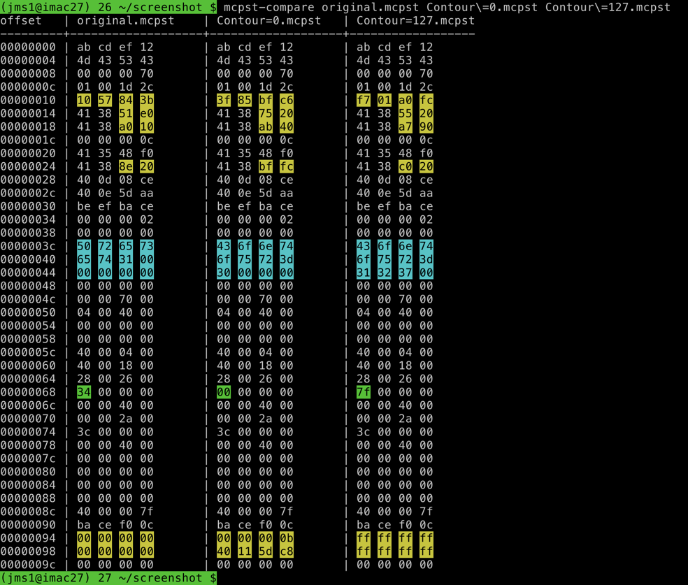

# Reverse Engineering Process

John Simpson `<jms1@jms1.net>` 2022-04-10

It's been several years, but I have reverse-engineered file formats in the past. The last time was back in 2005, when I figured out the format of an amateur radio's memory dump files. If you're curious, [here's the link](https://kg4zow.us/dj296/memory.utf8.txt) to what I wrote up at the time. (I apologize for the formatting, if Markdown *existed* back then I wasn't aware of it.)

## Scripts

Both of these scripts are in the `scripts/` directory in this repo.

### `mcpst-dump`

This is the script I started off wanting to write. It started as a basic "hex dump", and then as I figured out where the value of each parameter was stored, I added some code to show that parameter, in some cases using the same specific format that the Model:Cycles uses.

### `mcpst-compare`

This is a script I wrote to help me compare two or more binary files. It shows hex dumps of the files, with certain bytes highlighted.

* Bytes holding the preset name are highlighted in blue.

* Bytes which are *not* the same in all of the files, whose purpose I know, are highlighted in green.

* Bytes which are *not* the same in all of the files, whose purpose I *don't* know, are highlighted in yellow.

* Bytes which have the same value in all of the files are not highlighted.

This script allowed me to *quickly* identify which bytes were different between different sets of files.

## Procedures

Doing the "big things" (like figuring out where and how a particular parameter is stored) involves doing sequences of "little things" over and over. Before I go into the "big things", here are the "little things" I had to re-learn.

### Saving `.mcpst` files on the Model:Cycles

I had read about this in the manual, but I had never needed to actually *do* it. I hadn't really done any "sound crafting" on the Model:Cycles, I had only played around with it as a drum machine using the built-in presets.

To save a "Preset" containing the synthesizer settings in use on the current track ...

* Select the track whose current settings you want to save.

    * Press one of [T1], [T2], [T3], [T4], [T5], or [T6].

* Func -> Preset Menu (the "drum" button to the right of the display)

* Navigate to the folder where you want to save the file.

    Note that you cannot save files under the "FACTORY" folder. I created a folder where I stored the files I'm creating for this reverse-engineering process.

* When you're in the appropriate folder, press FUNC and release it. (I know, it's weird to be using FUNC by itself instead of holding it down while pressing something else.)

* On the menu that pops up, select "Save Preset".

* Give the preset a name, up to 12 characters.

    I had to look up in the manual how to select the characters I wanted to use for the name. The process is...

    * Rotate the Level/Data knob to select *which* character to change. The names are up to 12 characters long, but because of the size of the screen they're shown in two rows of six.

    * Press and hold FUNC. A grid of letters will appear. Rotate the Level/Data knob to select a character. When you let go of FUNC, the selected character will be entered into the current position in the filename, and the cursor will jump to the next position.

    * When you've entered the name you want, press down on the Level/Data knob. The Model:Cycles will ask if you want to save the preset, and allow you to choose one of (Yes/Abort/Edit).

    * Rotate the Level/Data knob so you're on "Yes", then press down on the knob.

### Copying `.mcpst` files to a computer

Copying files to and from the Model:Cycles requires ...

* A Model:Cycles, obviously.

* A computer, running macOS (or windows, if that's what you're stuck with).

* A USB cable connecting the two.

* The Elektron "Transfer" app. If you don't already have it, you can download it from [Elektron's web site](https://www.elektron.se/support/?connection=transfer).

    There is also a program called [elektroid](https://github.com/dagargo/elektroid) for Linux. People have reported that it works with most Elektron devices, including the Model:Cycles. I haven't tried it myself, however the fact that it comes with a command line utility makes me wonder if I could compile it on macOS...

Procedure ...

* Run the Transfer app and connect to the Model:Cycles.

* Click the "Explore" tab at the top right.

    In the window you're looking at, the left side is a directory on your computer and the right side is a directory on the Model:Cycles.

* Make sure the drop-list at the top right is on "Presets". If the files you want to copy are in a folder, navigate into that folder.

* Make sure the drop-list at the top left is on "My Computer". Navigate to the directory where you want the files to be copied.

* To download files from the Model:Cycles, drag and drop the files from the list on the right, to the list on the left.

* You can upload files *into* the Model:Cycles by dragging and dropping from the list on the left, to the list on the right.

### Figure out where parameters are stored

On the Model:Cycles, start a new pattern. In my case, I had already done a factory reset on the unit, so I used pattern C1. This will load the six tracks with the standard "presets" - kick on T1, snare on T2, and so forth.

Choose one of the tracks to work with. In my case I used T5.

Before you do anything else, save the preset so you have a base file to compare other files against. Give it a name like "`original`", so you know what it is.

Then, for each parameter ...

* **Pick which parameter you're investigating**. For example, let's choose Sweep.

* Make a note of what the current value of the parameter is (i.e. turn the knob just barely enough for it to show the current value but not change it, and write down what the value is) *before* you change anything.

    This should be the same value as what's in the "`original`" file.

* Save three or more presets with different values of that parameter.

    When I did this, I saved presets with the lowest possible value, the highest possible value, and some other value, so I would be able to compare at least three files with each other.

    I also saved the presets with names that indicated which parameter I was changing and what the value was. For example, when I stored a Preset with Sweep set to 0, I saved it as "`Sweep=0`". (The "`=`" character is all the way at the bottom of the letter grid.)

    * Change the value. Save a new preset.

    * Change the value again. Save a new preset.

    * Change the value a third time. Save a new preset.

    When you've saved the presets, **change the value back to where it started**. This way, when you move on to the next parameter, the value of *this* parameter will match what's in the "`original`" file and it won't show up as a "different" byte when you compare the files.

* Copy the preset files to the computer. Also copy the "`original`" file if you haven't already copied it.

* Use the `mcpst-compare` script to compare the `original` file against your modified files. You will notice several differences between the files, however one of the values you'll see changing will correspond to the parameter value you changed. This tells you which byte within the binary file contains the value of that particular parameter.

    Markdown doesn't have a way to include *coloured* text, so here's a screenshot to show what the output looks like:

    

    In this example, you can see that the byte at `0068` has the value (`34` hex, 52 decimal) in the original file, (`00` hex, 0 decimal) in the `Contour=0.mcpst` file, and (`7f` hex, 127 decimal) in the `Contour=127.mcpst` file. (They're highlighted in green here because the script *knows* what that byte is for. When I originally did this command those bytes were highlighted in yellow, like the ones at the top and bottom.)

* Set the parameter you've been changing, back to its original value. This way when you're doing future comparisons, that value will match what was in the original file rather than continuing to show up as a difference.

Then pick a different parameter and do it again, until you've figured out where all of the parameters are within the file.

At the moment, I've figured out where and how ten of the parameters are stored in the file. There are several I haven't been able to figure out yet - either the values are stored in a format I'm not recognizing (i.e. in the "yellow splotches" at the top or bottom of the file), or they're things which aren't part of a preset to begin with (such as CHANCE and COND, which are properties of a track or a trigger - they have to do with *how* and *when* the sound is played, rather than with what it sounds like.)
